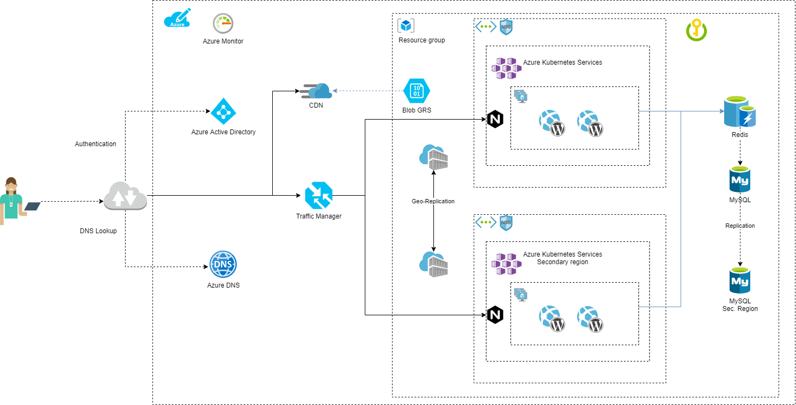
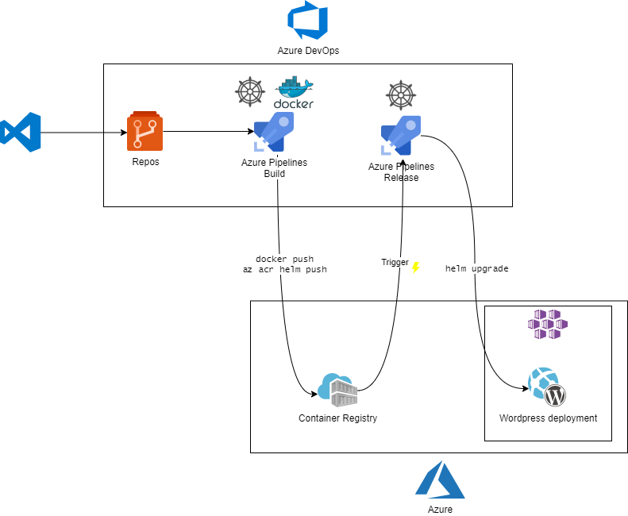

# Table of Contents
- [Sentia case study](#sentia-case-study)
- [Infrastructure Architecture Diagram](#infrastructure-architecture-diagram)
- [Architecture decisions](#architecture-decisions)
  * [Components](#components)
- [Security considerations](#security-considerations)
  * [Encryption](#encryption)
  * [Networking](#networking)
- [Monitoring](#monitoring)
- [CI/CD Pipeline](#ci-cd-pipeline)

# Sentia case study

Original premise: https://github.com/sentialabs/public-cloud-recruitment/blob/master/ASSIGNEMENT.md

# Infrastructure Architecture Diagram

Draw.io link: https://drive.google.com/file/d/197FaQdYzgOun2gNo18B4MF_6uT1MyUOU/view?usp=sharing

# Architecture decisions
Infrastructure is a high availability layout balancing traffic to a primary region, but replicating to a secondary region in different fashion for each component. Applications (e.g. Wordpress sites) will be containerized and deployed to Azure Kubernetes Services where we can establish an autoscaling for pods and nodes, and thus adapt to different traffic loads.

## Components
- __Resource Group__: Main resource group containing all components. It was considered to create a second one for replicated/balanced components, but it doesn't really bring any benefits (Resource Groups are only logical containers) and it would increase complexity in ARM template deployment. Location for it is primary region.

    _Note: There's another Resource Group created for Azure Monitor services, specifically for Log Analytics workspace. However, this is not part of the main ARM deployment, although there is a template for deploying it beforehand to fill monitoring dependencies. [Link](ARM/LogAnalytics/)_

- __Traffic Manager Profile__: Balances traffic based on priority where primary location is preferred, and secondary location has a lowest priority. It's configured with a CNAME record created in Azure DNS Zone created in the Resource Group. Both backend are treated as external endpoints pointing to two A records also created in the same DNS zone. It's intended for those records to be modified once AKS clusters have their own ingress controller with a public IP address.

- __Azure DNS Zone__: Set up with a default value of `sentiademo.com` it's created so records for the services can be managed in the deployment. During first implementation, it's used by Traffic Manager profile to create endpoints URIs.

- __Storage Account__: Deployed with SKU `Standard_GRS` so it's replicated accross regions. This provides enough reliability in case of a downtime in the primary region. It's intended for serving files to be hosted by the applications, and it's configured to serve them using a CDN to improve user experience.

- __Container Registry__: Registry destined to be consumed by AKS clusters, providing a geo-replication service (primary and secondary location) for redundancy, and closer geographic access to each cluster, but only having one public endpoint which simplifies it's consumption. Geo-replication requires a `Premium` SKU.

- __Key Vault__: Mandatory for storing secrets for applications. During initial deployment, it's used to store user and password for MySQL database.

- __Networking__: Each AKS cluster is container within its Virtual Network with `/16` mask, and a subnet with `/24` mask. Subnets are linked to Network Security Groups that contain default rules plus an inbound rule allowing traffic to port 443; it's expected for clusters to serve HTTPS traffic.

- __Azure Redis Cache__: Cache service is added to improve connection between applications and database connections. It's mentioned that traffic has been increasing to the sites, which will most likely impact access to databases. A cache implementation will cache most used queries, making subsequent requests faster and reducing DB load during peak times.

- __Azure MySQL Database__: Wordpress database requirements specify a need for MySQL databases. Azure provides a PaaS implementation that solves it's installation, and already offers a 99.99% SLA. Its flexibility for implementation and scaling provides a better experience for database management, without compromising expected capabilities. To provide further reliability, a replica is created to a secondary region in a master-slave design. Although switching a slave instance to master is not automatic (it's possible creating an Azure Function), it's expected to an ocurrence where it's needed is extremely rare.

- __Azure Kubernetes Services__: Two clusters, one per region (primary and secondary), with same specifications. AKS clusters are deployed using `kubenet` networking plugin. Both clusters should contain same services and act in a failover schema. Load balancing between the two is performed by Traffic Manager. 

    AKS provides the best solution for flexibility and scalability for any kind of traffic load. Kubernetes pods austoscaling fulfills its need to create replicas of the same application to serve requests. Pod Autoscaling can be set with manual limits, or setting up a Vertical Pod Autoscaling for automatic assessment. With AKS Nodes Autoscaling, provided by its nodes deployed in Virtual Machine Scale Sets, pods replicas will never find themselves unable to be allocated.

# Security considerations
## Encryption
MySQL databases contain already embedded security measures provided by Azure. On deployment, DB has implemented in-transit encryption with TLS, and at-rest encryption uses the FIPS 140-2 validated cryptographic module. [More info here.](https://docs.microsoft.com/en-us/azure/mysql/concepts-security)

Storage account also has the capability. At deployment, at-rest encryption is implemented using FIPS 140-2, and can't be disabled.

Connection to web services will be encrypted applying TLS certificates that will be created in AKS as secrets, and used later by ingress resources. _Note: TLS certificate was not included in the architecture diagram assuming it will be issued by some procurement process. However, it could be deployed using an App Service Certificate, and validating it with the already deployed DNS zone._

## Networking
Connections to an Azure Database for MySQL server are first routed through a regional gateway. The gateway has a publicly accessible IP, while the server IP addresses are protected. A newly created Azure Database for MySQL server has a firewall that blocks all external connections by default. ARM template adds a default rule to allow the current virtual network.

As stated above, subnets are contained by Network Security Groups with default rules and allowing inbound traffic for port 443.

Ingress Controller for the clusters are NGINX instances with ModSecurity addon, providing a WAF solution to cover attack vectors.  NGINX Ingress Controller for Kubernetes provides enterprise‑grade delivery services for Kubernetes applications. [ModSecurity-nginx connector info here.](https://kubernetes.github.io/ingress-nginx/user-guide/third-party-addons/modsecurity/)

# Monitoring
All components are registered to Log Analytics workspace ensuring a full logging capability for the platform. On top of that, [Azure Monitor for Containers](https://docs.microsoft.com/en-us/azure/azure-monitor/insights/container-insights-overview) provide metrics for microservices. 

While this scenario already uses several metrics, if monitoring is still lacking metrics, Prometheus metrics support is offered by Azure Monitor and it's easily deployable. [More info here.](https://docs.microsoft.com/en-us/azure/azure-monitor/insights/container-insights-prometheus-integration)

# CI/CD Pipeline
